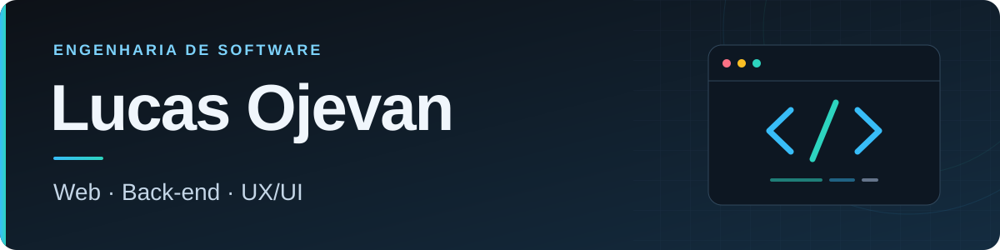

  

### Olá! Sou o Lucas 👋

**Estudante de Engenharia de Software, com foco em desenvolvimento web e interesse em back-end e UX/UI.**

## 👨‍💻 Sobre mim

Gosto de entender como uma aplicação funciona por inteiro: da interface que a pessoa usa às regras de negócio e à organização dos dados. Minha experiência acadêmica e prática inclui desenvolvimento web, consultas SQL, modelagem de bancos de dados e versionamento com Git.

- 🌱 **Aprendizado atual:** desenvolvimento full stack, integração de APIs e modelagem de dados.
- 🎨 **UX/UI:** estudo wireframes, prototipação, testes de usabilidade, acessibilidade e interfaces responsivas.
- 🎯 **Objetivo:** primeira oportunidade profissional em tecnologia, com interesse em estágio e colaboração.

## 🛠️ Tecnologias e ferramentas

Ferramentas que utilizo em projetos e nos meus estudos.

**Linguagens**

**Desenvolvimento web**

**Bancos de dados e persistência**

**Versionamento, ambiente e design**

## 🎓 Formação

| Formação | Instituição | Situação |
| :--- | :--- | :--- |
| Engenharia de Software | Universidade Anhembi Morumbi | Cursando · conclusão prevista em dezembro de 2029 |
| Técnico em Informática | Senac Lapa Tito | Concluído |

**Idiomas:** Português nativo · Inglês intermediário

<strong>📊 Estatísticas do GitHub</strong>

 

  
  

---

**Vamos conversar?**

Aberto a oportunidades de estágio e colaboração em tecnologia.

[Entre em contato pelo LinkedIn](https://www.linkedin.com/in/lucas-ojevan-b20175319)

